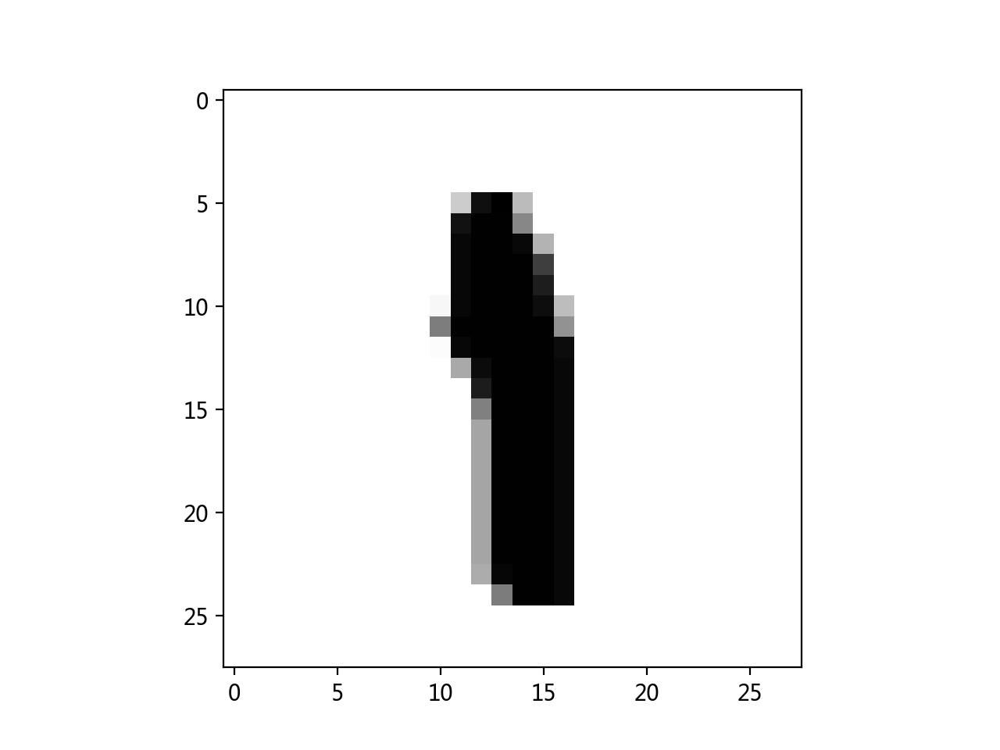
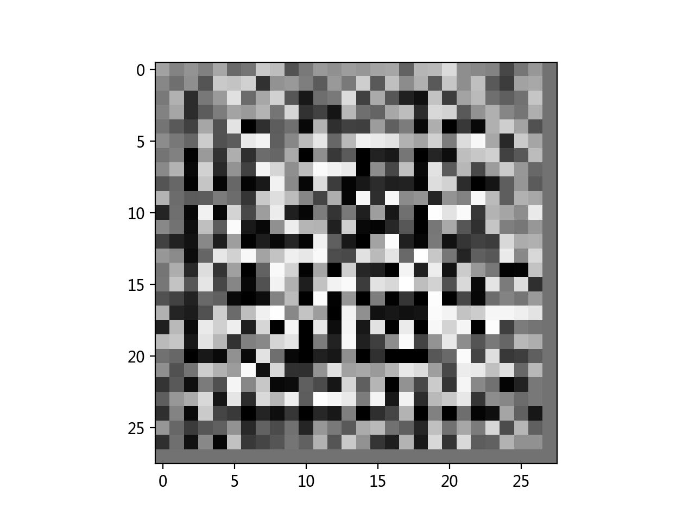
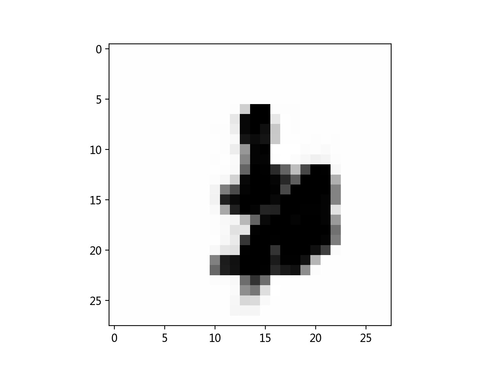

## 生成对抗网络实验报告
- 阅读论文,理解GAN的原理 Generative Adversarial Nets，an J. Goodfellow, Jean Pouget-Abadie∗, Mehdi Mirza, Bing Xu, David Warde-Farley, Sherjil Ozair†, Aaron Courville, Yoshua Bengio‡，2014
- 基于MNIST数据集,完成GAN的训练代码
- 参考 `getstart/` 的代码

- MNIST原图

- 噪声图

- GAN生成的图

